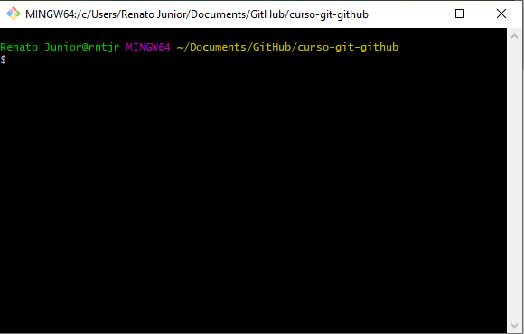
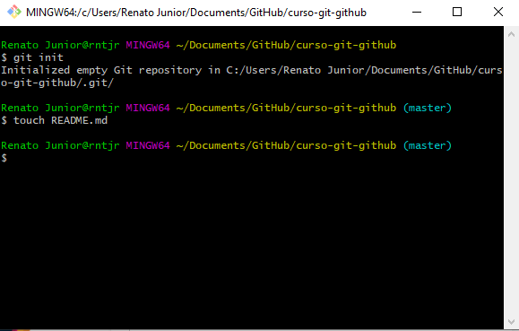
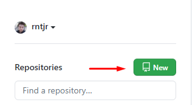
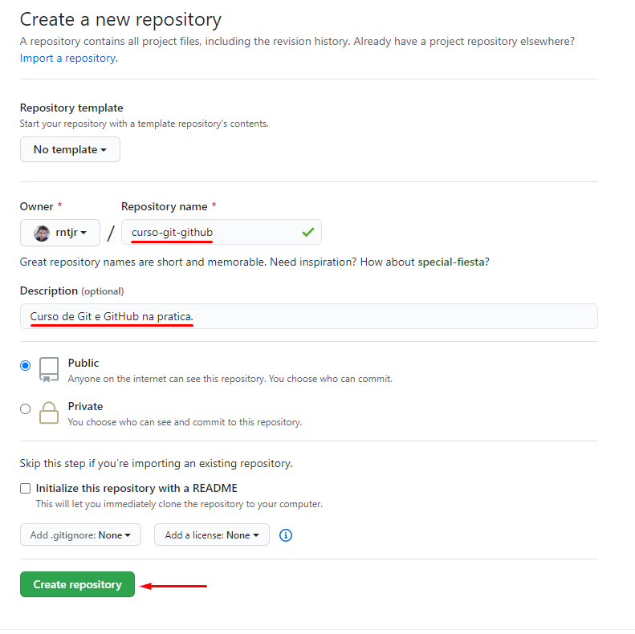
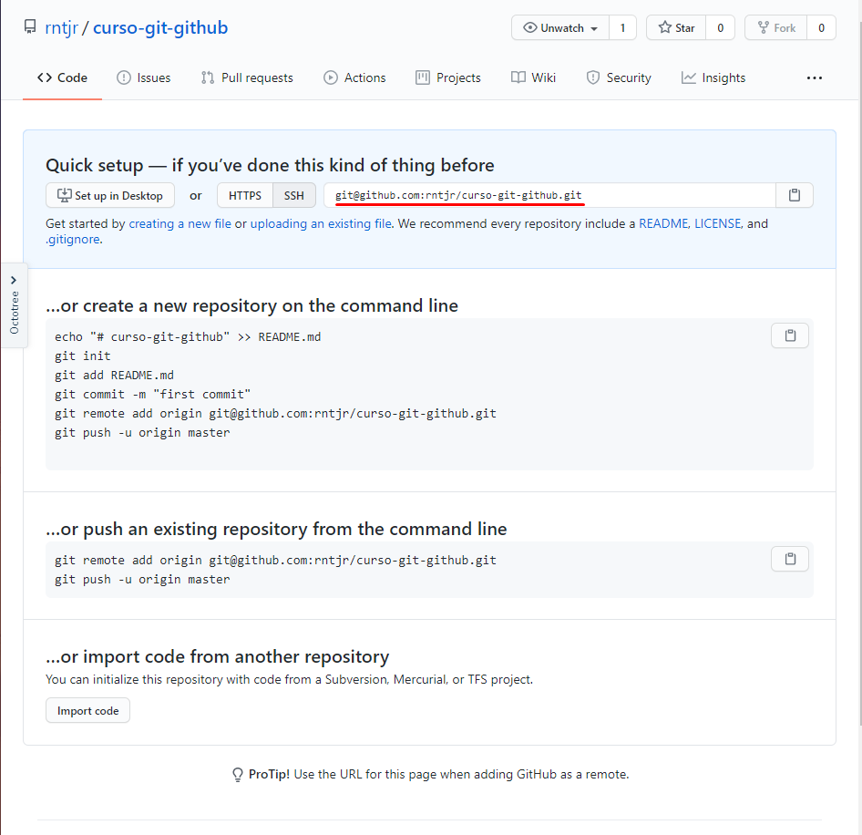

# [Curso de Git e GitHub na pratica.](https://www.udemy.com/course/git-e-github-na-vida-real)

## Aula 3 - Inicializando o repositório

### Conteúdo da aula:

Crie uma pasta em qualquer local do computador, abre o Terminal ou Git Bash dentro dela. Você verá algo parecido com isso:

Inicializando o repositório local com o comando `git init`, criando o arquivo `README.md` e adicionando conteúdo ao mesmo para a aula.

Também deve criar um repositório remoto no GitHub seguindo os seguintes passos:

Copie o URL grifado e digite o comando `git remote add origin URL-copiado`, exemplo:
`git remote add origin git@github.com:rntjr/curso-git-github.git`

Escreva algo dentro do arquivo README.md, digite no terminal `git add .` e depois `git commit -m "Commit Inicial do Projeto"`. O texto dentro de áspas pode ser qualquer coisa que preferir.
